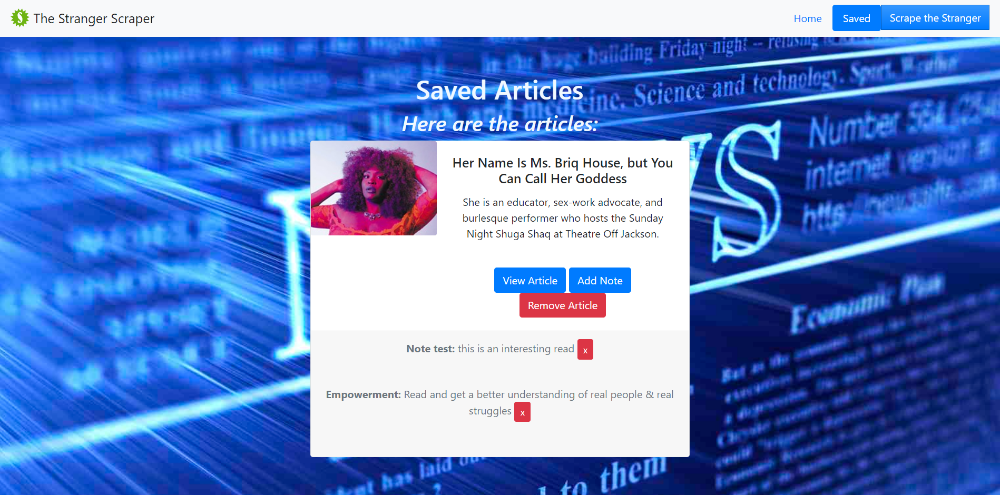

# StrangerScraper
Scraping the stranger for articles
To get more articles click on the scrape button which will grab the featured articles on the stranger site.
This will grab articles to render to the homepage only if they have not already been scraped.
Users will be able to save/remove articles and make/delete notes on saved articles.

## Installation

  - clone/run this repo by copying the clone link: 'https://github.com/Pironj/StrangerScraper'
  - open up gitbash in your cmd line and run git clone url to location of your choice on your local directory.
  - open the files in your code editor and open in browers

Link to deployed: https://dashboard.heroku.com/apps/true-marks-32161

## ScreenShot of App
  # Home Page

  # Saved Article Page

## Technologies:
* MongoDB
* Mongoose.js
* Node
* Express
* Handlebars
* axios
* cheerio
* morgan
